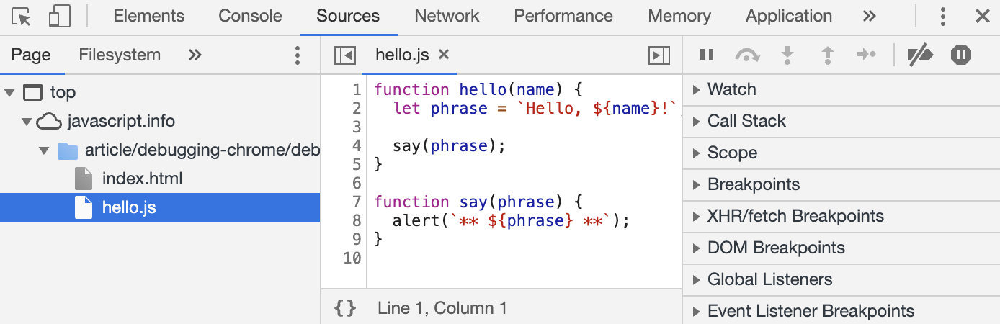
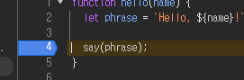

# Chrome으로 디버깅
- Chrome [링크](https://ko.javascript.info/article/debugging-chrome/debugging/index.html) 접속 -> F12 -> Source -> hello.js 클릭하여 코드 수정
- 파일 탐색 영역 - 코드 에디터 영역 - 자바스크립트 디버깅 영역
  - 
- ESC로 하단 Console 열기
- 디버그 설정 (코드 왼쪽 영역 클릭)
  - 
- F5를 눌러 중단점 작동
- Colsole 출력
```js
for (let i = 0; i < 5; i++) {
  console.log("숫자", i);
}
```