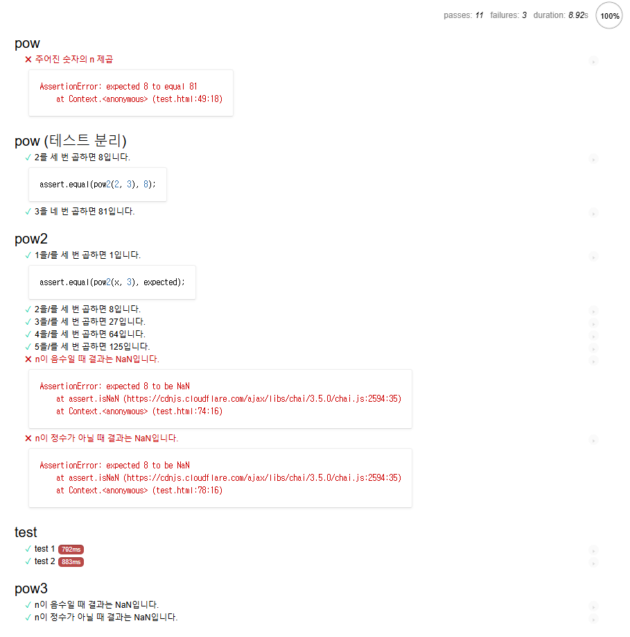

# 테스트 코드

### Behavior Driven Development([BDD](https://en.wikipedia.org/wiki/Behavior-driven_development))
- BDD는 테스트(test), 문서(documentation), 예시(example)를 한데 모아놓은 개념입니다.

```js
describe("pow", function() { // 기능 설명
  it("주어진 숫자의 n 제곱", function() { // UseCase 설명
    assert.equal(pow(2, 3), 8); // 테스트
  });
});
```
- Example https://plnkr.co/edit/1YAPD11aTL0txGB6?p=preview
- Test Framework
  - [Mocha](http://mochajs.org/)
  - [Chai](http://chaijs.com/)
  - [Sinon](http://sinonjs.org/)
  - 고수준 테스트 러너 [karma](https://karma-runner.github.io/)
- 기본형
```html
<!DOCTYPE html>
<html>
<head>
  <!-- 결과 출력에 사용되는 mocha css를 불러옵니다. -->
  <link rel="stylesheet" href="https://cdnjs.cloudflare.com/ajax/libs/mocha/3.2.0/mocha.css">
  <!-- Mocha 프레임워크 코드를 불러옵니다. -->
  <script src="https://cdnjs.cloudflare.com/ajax/libs/mocha/3.2.0/mocha.js"></script>
  <script>
    mocha.setup('bdd'); // 기본 셋업
  </script>
  <!-- chai를 불러옵니다 -->
  <script src="https://cdnjs.cloudflare.com/ajax/libs/chai/3.5.0/chai.js"></script>
  <script>
    // chai의 다양한 기능 중, assert를 전역에 선언합니다.
    let assert = chai.assert;
  </script>
</head>

<body>

  <script>
    function pow(x, n) {
      /* 코드를 여기에 작성합니다. 지금은 빈칸으로 남겨두었습니다. */
    }
  </script>

  <!-- 테스트(describe, it...)가 있는 스크립트를 불러옵니다. -->
  <script src="test.js"></script>

  <!-- 테스트 결과를 id가 "mocha"인 요소에 출력하도록 합니다.-->
  <div id="mocha"></div>

  <!-- 테스트를 실행합니다! -->
  <script>
    mocha.run(); // 테스트 실행해주는 명령어 
  </script>
</body>

</html>
```
- 심화형
```html
<!DOCTYPE html>
<html>
<head>
  <!-- 결과 출력에 사용되는 mocha css를 불러옵니다. -->
  <link rel="stylesheet" href="https://cdnjs.cloudflare.com/ajax/libs/mocha/3.2.0/mocha.css">
  <!-- Mocha 프레임워크 코드를 불러옵니다. -->
  <script src="https://cdnjs.cloudflare.com/ajax/libs/mocha/3.2.0/mocha.js"></script>
  <script>
    mocha.setup('bdd'); // 기본 셋업
  </script>
  <!-- chai를 불러옵니다 -->
  <script src="https://cdnjs.cloudflare.com/ajax/libs/chai/3.5.0/chai.js"></script>
  <script>
    // chai의 다양한 기능 중, assert를 전역에 선언합니다.
    let assert = chai.assert;
  </script>
</head>

<body>

  <script>
    function pow(x, n) {
      return 8; // 속임수를 써봤습니다. :)
    }
    function pow2(x, n) {
      let result = 1;

      for (let i = 0; i < n; i++) {
        result *= x;
      }
    
      return result;
    }
    function pow3(x, n) {
      if (n < 0) return NaN;
      if (Math.round(n) != n) return NaN;

      let result = 1;

      for (let i = 0; i < n; i++) {
        result *= x;
      }
      return result;
    }

    describe("pow", function() {
      it("주어진 숫자의 n 제곱", function() {
          assert.equal(pow(2, 3), 8);
          assert.equal(pow(3, 4), 81);
      });
    });
    describe("pow (테스트 분리)", function() {
      it("2를 세 번 곱하면 8입니다.", function() {
        assert.equal(pow2(2, 3), 8);
      });

      it("3을 네 번 곱하면 81입니다.", function() {
        assert.equal(pow2(3, 4), 81);
      });
    });
    describe("pow2", function() {
    
      function makeTest(x) {
        let expected = x * x * x;
        it(`${x}을/를 세 번 곱하면 ${expected}입니다.`, function() {
          assert.equal(pow2(x, 3), expected);
        });
      }
      for (let x = 1; x <= 5; x++) {
        makeTest(x);
      }
      
      it("n이 음수일 때 결과는 NaN입니다.", function() {
        assert.isNaN(pow(2, -1));
      });
    
      it("n이 정수가 아닐 때 결과는 NaN입니다.", function() {
        assert.isNaN(pow(2, 1.5));
      });
    });
    describe("test", function() {
      before(() => alert("테스트를 시작합니다 - 테스트가 시작되기 전"));
      after(() => alert("테스트를 종료합니다 - 테스트가 종료된 후"));
      beforeEach(() => alert("단일 테스트를 시작합니다 - 각 테스트 시작 전"));
      afterEach(() => alert("단일 테스트를 종료합니다 - 각 테스트 종료 후"));
      it('test 1', () => alert(1));
      it('test 2', () => alert(2));
    });
    describe("pow3", function() {
      it("n이 음수일 때 결과는 NaN입니다.", function() {
        assert.isNaN(pow3(2, -1));
      });
      it("n이 정수가 아닐 때 결과는 NaN입니다.", function() {
        assert.isNaN(pow3(2, 1.5));
      });
    });
  </script>

  <!-- 테스트(describe, it...)가 있는 스크립트를 불러옵니다. -->
  <script src="test.js"></script>

  <!-- 테스트 결과를 id가 "mocha"인 요소에 출력하도록 합니다.-->
  <div id="mocha"></div>

  <!-- 테스트를 실행합니다! -->
  <script>
    mocha.run(); // 테스트 실행해주는 명령어 
  </script>
</body>

</html>
```

